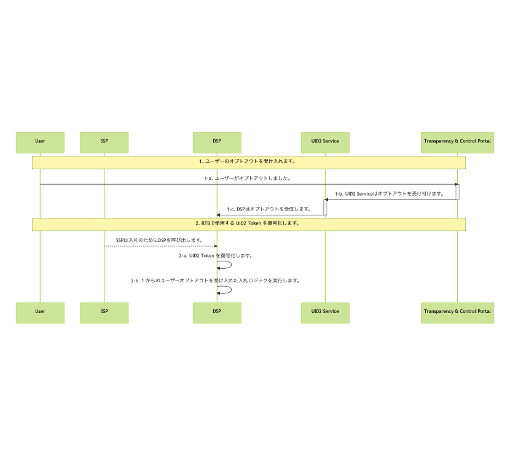

# DSP Integration Guide

このガイドは、ビッドストリームで UID2 の取引を行うDSPを対象としています。

以下のセクションが含まれています：

- [Integration Steps（インテグレーション手順）](#integration-steps)
  - [Honor User Opt-Outs（ユーザーオプトアウトの受け入れ）](#honor-user-opt-outs)
  - [Decrypt UID2 Tokens for RTB Use（RTB で使用する UID2 Token の復号化）](#decrypt-uid2-tokens-for-rtb-use)
- [FAQs（よくある質問）](#faqs)

## Integration Steps

以下は、RTB で UID2 をサポートするための DSP のインテグレーションワークフローで、大きく 2 つのステップで構成されています:

1. [Honor user Opt-Outs（ユーザーオプトアウトの受け入れ）](#honor-user-opt-outs)
2. [Decrypt UID2 tokens to use in RTB（RTB で使用する UID2 Token の復号化）](#decrypt-uid2-tokens-for-rtb-use)



### Honor User Opt-Outs

UID2 Service からのユーザーのオプトアウトを受け取り、それを受け入れるために、DSP はオンボーディング時に、あらかじめ設定されたインターフェースを UID2 Service に提供します。UID2 Service は、ユーザーの UID2 とオプトアウトのタイムスタンプを、事前に設定されたインターフェースに送信します。インターフェースの例としては、webhooks や API エンドポイントなどがあります。

UID2 Service は、ユーザーがオプトアウトしてから数秒以内に以下のデータを送信します。これを DSP が記録し、[Decrypt UID2 Tokens for RTB Use](#decrypt-uid2-tokens-for-rtb-use) で定義されている入札ロジックを使用するようにします。

| Parameter   | Description                            |
| :---------- | :------------------------------------- |
| `identity`  | オプトアウトしたユーザーの UID2 です。 |
| `timestamp` | ユーザーがオプトアウトした時刻です。   |

次の例は、UID2 とそれに対応するタイムスタンプを受信するように設定された Webhook を示しています。

```html
https://dsp.example.com/optout?user=%%identity%%&optouttime=%%timestamp%%
```

#### Bidding Opt-Out Logic

入札時（2-b）に以下のロジックを使用し、ユーザーのオプトアウトを受け入れます。

提供されている [Server-Side SDK Guide](../sdks/dsp-client-v1-overview.md) を活用して、受信した UID2 Token を復号化できます。レスポンスには UID2 と UID2 が作成された時刻が含まれ、以下の疑似コードでは `established_timestamp`と表現されます。DSP は UID2 の最新のオプトアウトタイムスタンプを確認する必要があります。以下の疑似コードでは `optout_timestamp`と表現されています。

オプトアウトのロジックを次の図に示します。


もし`established_timestamp`の値が`optout_timestamp`の値より小さい場合は、ユーザーがオプトアウトしたことになり、UID2 は RTB に使用するべきではありません。このような場合、代替 ID を送信して入札するか、入札しないかは、DSP の判断によります。

<b>Check Opt-Out</b> ステップのロジックは以下のとおりです。

```java
if (established_timestamp < optout_timestamp) {
  // Opted out
}
```

### Decrypt UID2 Tokens for RTB Use

| Step | SDK                                                        | Description                                                                                                                                                                                             |
| :--- | :--------------------------------------------------------- | :------------------------------------------------------------------------------------------------------------------------------------------------------------------------------------------------------ |
| 2-a  | [Server-Side SDK Guide](../sdks/dsp-client-v1-overview.md) | 提供されている SDK を活用して、入力された UID2 Token を復号化します。レスポンスには `UID2` と UID2 の作成時刻が含まれます。                                                                             |
| 2-b  |                                                            | DSP は UID2 のオプトアウトプロトコルを受け入れることが要求されます。ユーザーオプトアウトの設定と入札時の受け入れは、[ユーザーオプトアウトの受け入れ](#honor-user-opt-outs) を参照してください。 |

## FAQs

DSP に関するよくある質問は、[FAQs for Demand-Side Platforms (DSPs)](../getting-started/gs-faqs.md#faqs-for-demand-side-platforms-dsps) を参照してください。

すべてのリストは、[Frequently Asked Questions](../getting-started/gs-faqs.md)を参照してください。
